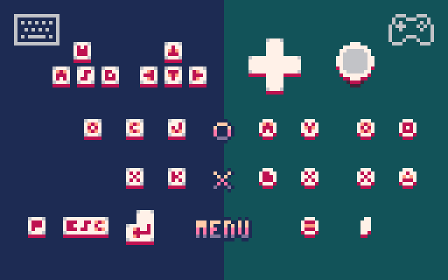

# BeetPx


> A TypeScript engine for pixel art browser games.

---

<!-- TOC -->
* [BeetPx](#beetpx)
  * [Getting Started](#getting-started)
    * [Examples](#examples)
  * [Game Controls](#game-controls)
  * [API](#api)
  * [Development Setup](#development-setup)
  * [The Origin](#the-origin)
  * [Credits](#credits)
    * [Fonts](#fonts)
    * [Color Palettes](#color-palettes)
    * [Bresenham's Algorithm implementation](#bresenhams-algorithm-implementation)
  * [Known Issues](#known-issues)
  * [Release Notes](#release-notes)
    * [v0.52.0](#v0520)
    * [v0.51.3](#v0513)
    * [v0.51.2](#v0512)
    * [v0.51.1](#v0511)
<!-- TOC -->

---

## Getting Started

In your terminal navigate to the parent folder in which you want to create your
BeetPx game. Then run:

```shell
npm init @beetpx/beetpx-game@latest my-game
cd my-game
npm install
```

where `my-game` is your desired directory/project name.

To make sure things are working correctly, continue with:

```shell
npm run tsc
npm start
```

### Examples

To see how to use the API, check out the examples:
https://github.com/beetrootpaul/beetpx-examples/

Also, you might want to take a look at how following projects are using BeetPx:

| game                   | GitHub repository                                                                                   | screenshot                                                       |
| ---------------------- | --------------------------------------------------------------------------------------------------- | ---------------------------------------------------------------- |
| **Hat Escape**         | [beetrootpaul/hat-escape](https://github.com/beetrootpaul/hat-escape)                               |          |
| **Dart-07**            | [beetrootpaul/dart-07-beetpx](https://github.com/beetrootpaul/dart-07-beetpx)                       |             |
| **Towers of Survival** | [beetrootpaul/towers-of-survival-beetpx](https://github.com/beetrootpaul/towers-of-survival-beetpx) |  |
| **Avoid Your Past**    | [beetrootpaul/avoid-your-past-beetpx](https://github.com/beetrootpaul/avoid-your-past-beetpx)       |     |

## Game Controls



The BeetPx engine supports a following sets of game buttons and their mappings
from physical devices:

| game button                          | keyboard               | DualSense controller | Xbox controller |
| ------------------------------------ | ---------------------- | -------------------- | --------------- |
| **O** (Maru)                         | `C` / `J` / `O`        | circle / square      | `A` / `Y`       |
| **X** (Batsu)                        | `X` / `K`              | cross / triangle     | `B` / `X`       |
| **menu**                             | `P` / `return` / `esc` | menu                 | menu            |
| **directions**                       | arrows / `WSAD`        | D-pad / sticks       | D-pad / sticks  |
| **mute/unmute**                      | `M`                    |                      |                 |
| **full screen**                      | `F`                    |                      |                 |
| **take screenshot** (if enabled)     | `]`                    |                      |                 |
| **browser screenshots** (fi enabled) | `}`                    |                      |                 |

Regarding the main game buttons on a keyboard, the intention is basically to
either play with left hand on `X`+`C` and right hand on arrows, or to place the
left hand on `WSAD`, then used `J`+`K` with the right hand. The `O` support is
added in order to reduce to entry barrier for a situation when the game author
uses the "⭕️" and "❌" on their sprites and a player doesn't realize what keys
should they use – there is a chance they would try with just `O`+`X` on their
keyboard.

Regarding th game controllers – other controllers might works as well. For
example, this engine has an implemented support for **8BitDo Lite 2**.

There are also **touch controls** in form of GUI buttons resembling a physical
ones. You can see and use them on touch devices like e.g. an iPhone.

Dev controls meant to be used by the game developer themselves and gated behind
related engine config fields:

- **toggle debug**:
  - on keyboard: `;`
- **toggle frame-by-frame**:
  - on keyboard: `,`
- **jump to the next frame** (only while in frame-by-frame mode):
  - on keyboard: `.`

ℹ️ To check if your controls work as expected, go to
https://beetrootpaul.itch.io/beetpx-input-tester .

## API

You can find docs at https://beetpx.dev .

ℹ️ For a quick start you can start by typing either `BeetPx.` and checking what
your IDE suggests. Same for `BeetPxDraw.`, and `BeetPxUtils.`. Their shorthands
are respectively: `$`, `$d`, and `$u`.

## Development Setup

This projects is developed on
[Node.js 18](https://nodejs.org/docs/latest-v18.x/api/index.html).

You might find it helpful to use
[nvm](https://github.com/nvm-sh/nvm#installing-and-updating) in order to make
sure you use the same Node.js version as which is specified in `.nvmrc` file.

There is no CI configured for this project. For now, it is developed by me only,
and all tests as well as the compilation happen in a pre-commit hook.

## The Origin

My idea for BeetPx came from a good time I had working on mini games in
[PICO-8](https://www.lexaloffle.com/pico-8.php). That fantasy consoles hit a
very sweet spot for me: in PICO-8 you are creating low resolution pixel art
games, to do so you use a globally available simple API, and all your creations
can easily run in a desktop browser or a mobile one.

There are though some areas I would like differently:

- I prefer to use a typed language and a one which follows a standard. In PICO-8
  I had to use a custom version of Lua, which meant difficulties in finding a
  decent extension for an IDE of my choice.
- PICO-8 has a token limit, which generally means a limit on how much code you
  are allowed to write and an incentive to use a short language constructs as
  possible rather than optimizing for a code maintenance. I understand this is a
  heated topic in PICO-8 community and I also see advantages of the limited
  approach – e.g. it helps to keep games low scoped and, in result finish them!
  Also, it is sometimes a real fun to come with clever solutions for hunting
  tokens down 😄. But when it comes to my personal preferences, I more often was
  frustrated by the token limit rather then enjoying it.
- There is a minor issues with a browser build of PICO-8 games, where the long
  press of a in-game button on iOS Safari results with a system text selection
  to appear and prevents from playing a game smoothly. Of course, this is
  something I could work around by adjusting an HTML template exported from
  PICO-8. But since I decided to create my own engine, I am able to take care of
  browser iOS experience and do it the way I like.
- Last but not least: I just wanted to have something created for public,
  [available on npm](https://www.npmjs.com/package/@beetpx/beetpx), something I
  feel I am capable to do and can be proud of later ☺️

That being said, I am very grateful that PICO-8 exists and there is a big
community around it. If not for PICO-8, BeetPx would never be created 💛

## Credits

### Fonts

While you are able (and encouraged) to define your own font (as an
implementation of `BpxFont` interface), there are 3 fonts ready to use in BeetPx
out of the box:

- `$font_pico8` (the default one)
- `$font_saint11Minimal4`
- `$font_saint11Minimal5`

The first one is a font from PICO-8 fantasy console, available under a CC-0
license (public domain, free to use). For more info see:
https://www.lexaloffle.com/pico-8.php?page=faq

Two other fonts are created by [Saint11](https://saint11.org/about/) and
available on https://saint11.org/blog/fonts/ under a CC-0 license (public
domain, free to use).

### Color Palettes

There is a PICO-8 color palette ready to use, exported as `$rgb_p8`. That
palette is created by zep and available under a CC-0 license (public domain,
free to use). For more info see: https://www.lexaloffle.com/pico-8.php?page=faq

### Bresenham's Algorithm implementation

I based the line and ellipse drawing methods on a Bresenham's Algorithm
implementation by Alois Zingl:
http://members.chello.at/easyfilter/bresenham.html

## Known Issues

- Gamepad input seems to be laggy (at least on Firefox), unsuitable for fast
  paced games.
- In iOS web browsers (Safari, Firefox, etc.) it is possible to go to the
  previous page by swiping the finger from the left edge. Which means, it is
  possible to accidentally close the game (while playing it on e.g. itch.io)
  when trying to use game touch buttons.

## Release Notes

### v0.52.1

- Game input: Fixed an issue of `"touch"` input method not being listed among others 
  in a set returned by `BeetPx.getRecentInputMethods()`.

### v0.52.0

- Game loop: Fixed an issue of timers and animations behaving in the draw callback 
  like if the next frame has already happened, even though its update callback was 
  not called yet.

### v0.51.3

- BpxAnimatedSprite: Added `t` computed property

### v0.51.2

- Console GUI on touch devices: Fixed the "O" button's press animation
- BpxVector2d: Added `neg()` method
- BpxVector2d: Added `$v_0_1` shorthand
- BpxVector2d: Added `$v_1_0` shorthand

### v0.51.1

- BpxVector2d: Fixed `normalize()` method so it treats `(0,0)` vector in a
  special by returning the `(0,0)`
